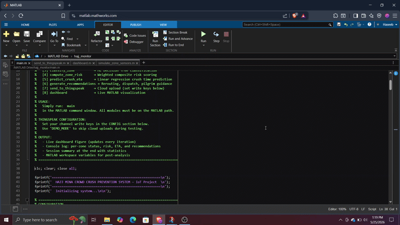
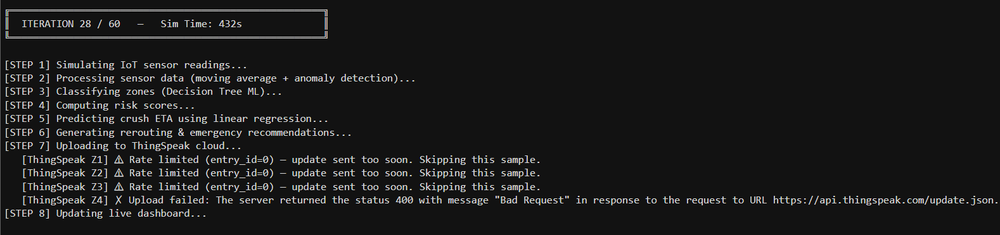
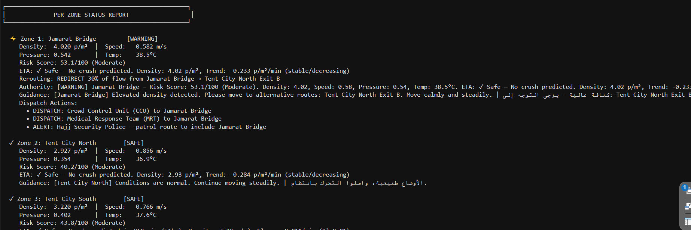
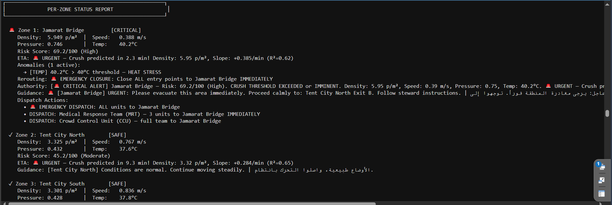

# 🕌 Hajj Crowd Crush Prevention System

Real-time IoT crowd monitoring system for the Hajj Mina area. Detects dangerous crowd density, predicts crush events using machine learning, and automatically triggers emergency response — built entirely in MATLAB with live ThingSpeak cloud integration.


---

## 🎥 Demo



---

## 📸 Screenshots







---

## How It Works

The system runs a 60-iteration loop. Every 16 seconds it:

1. **Simulates** IoT sensor readings for 4 Mina zones — density, speed, pressure, temperature
2. **Smooths** the data with a moving average filter and flags threshold anomalies
3. **Classifies** each zone as Safe / Warning / Critical using a trained Decision Tree (98.78% accuracy)
4. **Scores** a 0–100 risk value using a weighted formula
5. **Predicts** how many minutes until a crush (linear regression ETA)
6. **Generates** rerouting instructions, emergency dispatch, and bilingual pilgrim announcements
7. **Uploads** 6 fields per zone to ThingSpeak cloud via JSON POST
8. **Updates** a live MATLAB dashboard with color-coded zone status

At **iteration 35**, a critical surge is injected into Jamarat Bridge — all 4 sensors spike into the danger zone simultaneously, triggering full emergency protocols.

---

## Zones & Sensors

| Zone | Risk Level |
|------|-----------|
| Jamarat Bridge | Highest — narrow historic bottleneck |
| Tent City North | Moderate |
| Tent City South | Moderate |
| Emergency Exit Path | Low — must stay clear |

| Sensor | Danger Threshold |
|--------|-----------------|
| Crowd Density | > 6.0 people/m² |
| Movement Speed | < 0.30 m/s |
| Pressure Index | > 0.80 |
| Temperature | > 40.0 °C |

---

## Quick Start

```matlab
% In MATLAB command window
cd('hajj_monitor')
main
```

Requires MATLAB R2021a+ and the Statistics & Machine Learning Toolbox.

**To enable ThingSpeak uploads**, replace `'DEMO_MODE'` in `main.m` with your channel Write API Keys from [thingspeak.com](https://thingspeak.com).

---

## Files

```
hajj_monitor/
├── main.m
├── simulate_zone_sensors.m
├── process_zone_data.m
├── classify_zone.m
├── compute_zone_risk.m
├── predict_crush_eta.m
├── generate_recommendations.m
├── send_to_thingspeak.m
├── dashboard.m
└── assets/
    ├── demo.gif
    ├── screenshot1.png
    ├── screenshot2.png
    └── screenshot3.png
```